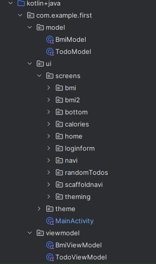

## 2024-Q3-Mobiiliohjelmointi

Tämä repositorio sisältää tekemiäni viikkotehtäviä mobiiliohjelmoinnin kurssilla Mobiiliohjelmointi
natiiviteknologioilla IN00CT07-3007

## Viikkotehtävien sijainnit

**repon ulkopuolella**

- Viikko 1: Kuvankaappaus Moodlessa

**mobiili-first**

- Viikko 2: BMI -muunnin
- Viikko 3: Kirjautumislomake ilman toiminnallisuutta
- Viikko 4: Teemat
- Viikko 5: Kalorit -laskuri
- Viikko 6: Scaffold -navigaatio
- Viikko 7: BMI käyttäen ViewModelia
- Viikko 8: MVVM ja API:n lukeminen (Json)

**mobiili-groupfour**

- 4-5:een tähtäävä kurssityö: Pocket Gate -sovellus

## Sovelluksen "first" -rakenne

## Sovelluksen "groupfour" -rakenne ja kuvia

